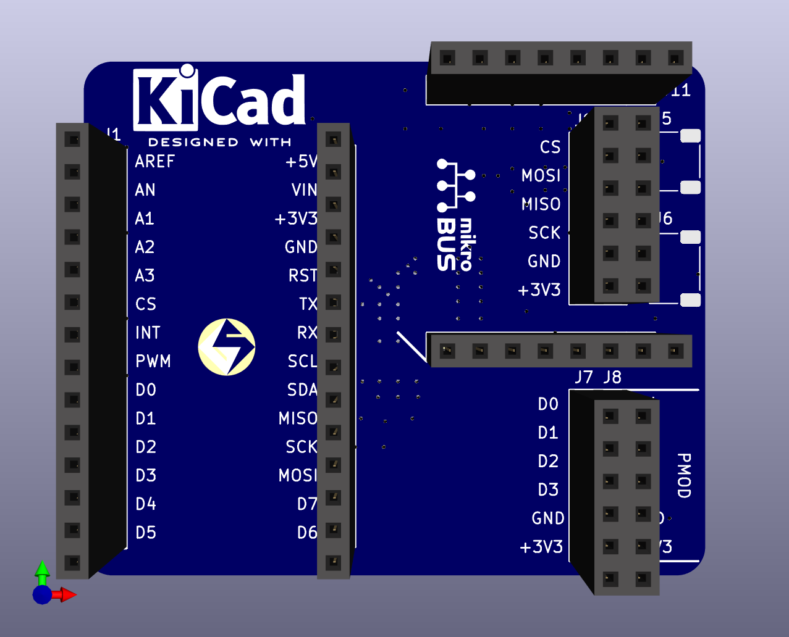
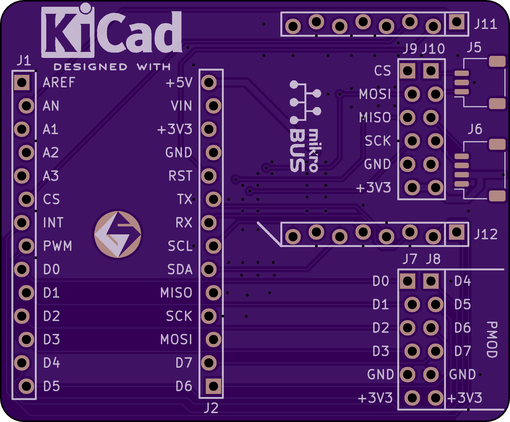
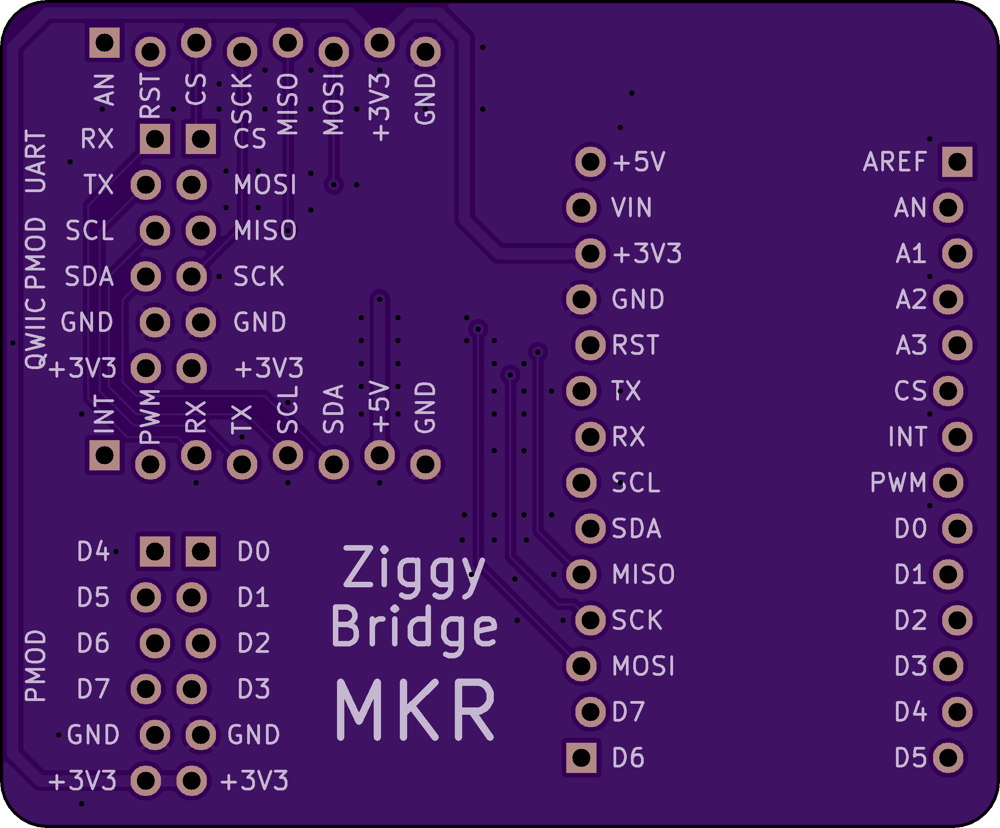

# Ziggy Bridge MKR

This is an adapter for boards in the Arduino MKR form factor, like some of the great low-cost FPGA boards from Trenz.

All of the 100mil pitch connectors use staggered footprints for friction fit so you can use the board without soldering.

This board adapts the MKR dual inline headers to the following connection standards:

 * 2x PMOD
 * mikroBUS Click
 * qwiic/Stemma-QT
 * Raspberry Pi UART

One of the PMOD connectors is issolated on pins D0-D7, the other is connected in parallel with the click/qwiic/uart connectors.

